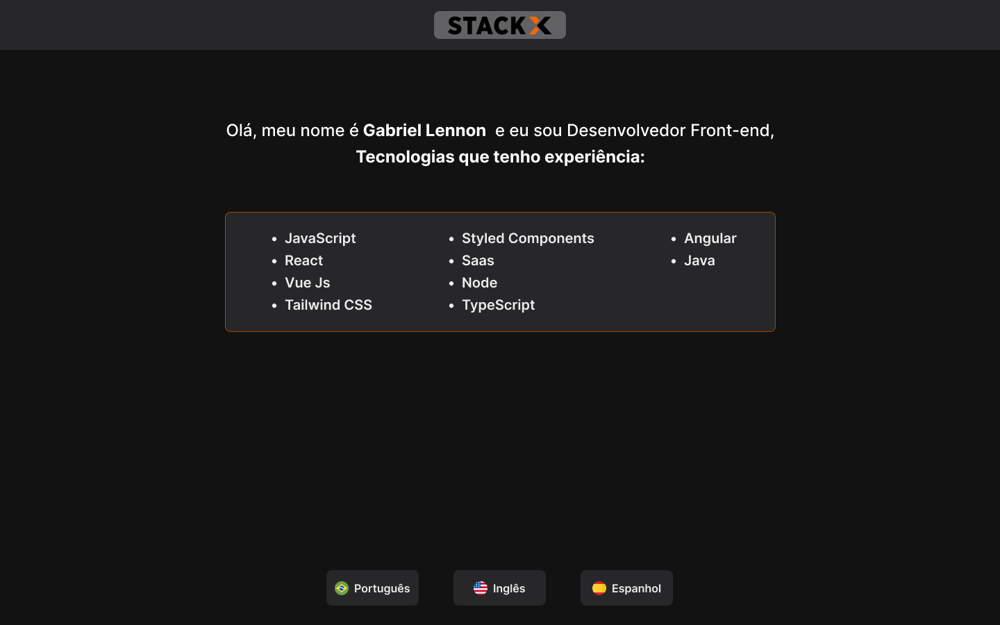

&nbsp; &nbsp; &nbsp;&nbsp; &nbsp; &nbsp;&nbsp; &nbsp; &nbsp;&nbsp; &nbsp; &nbsp;&nbsp; &nbsp; &nbsp;&nbsp; &nbsp; &nbsp;&nbsp; &nbsp; &nbsp;&nbsp; &nbsp; &nbsp; 

&nbsp; &nbsp; &nbsp; 

&nbsp; &nbsp; &nbsp; 


# Tecnologias da Web3

Este projeto é um exemplo de utilização das tecnologias da 
Web3, incluindo o Angular, Vue.js e React.js.

<br>

## Descrição



Este projeto consiste em três aplicações que resultam na mesma tela mas cada uma construída com uma das tecnologias mencionadas acima. Cada aplicação tem como objetivo demonstrar o uso de tecnologias da Web3 para a construção de aplicações modernas.

<br>

## Instalação

Para acessar o projeto desejado, basta entrar na pasta correspondente usando o comando dependendo do projeto desejado.
```bash
cd "nome do projeto: angular, vue, react"
```
 Em seguida, instale as dependências do projeto usando o comando 
 ```nodejs
 npm install
 ```
 Por fim, inicie a aplicação com o comando 
 ```
 npm start
 ```
⚠️ Certifique-se de ter o Node.js instalado em seu computador antes de prosseguir com a instalação.
